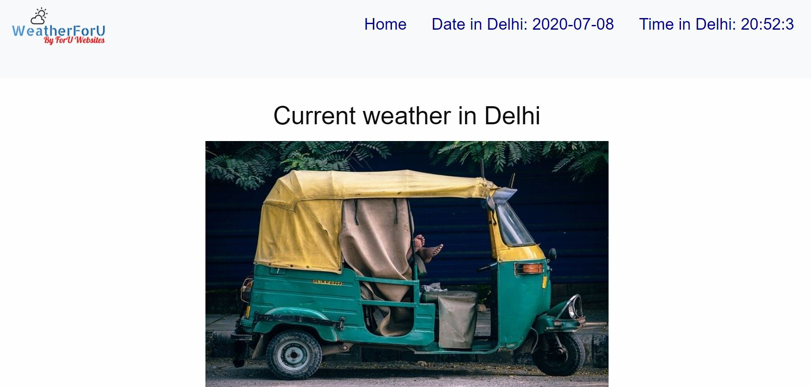

# WeatherForU Web App

## Description
A website which gives info about a required city's weather or the weather updates of the current location of the user. Made using Django and some API's

This is an open source project. Feel free to open issues if you find any bug or want to add some feature.

[Download the App](https://adityaashvin.github.io/weatherforuweb.github.io/)

## Features of the website
>1. Gives weather updates for any major city in the world and also gives weather updates of the current location of the user.
>2. Weather updates include temperature, humidity, maximum temperature, minimum temperature, atmospheric pressure, and a basic description(such as "light drizzle", "mist", "cloudy" to name a few)
>3. The local time and date of the city searched is also displayed in the navbar.
## Steps to run this in yoour local machine
### 1. Clone the repo
> git clone https://github.com/AdityaAshvin/WeatherForU.git
### 2. Install python
> https://realpython.com/installing-python/
### 3. Install django
> https://docs.djangoproject.com/en/3.0/topics/install/
### 4. Install required addition dependencies
> Run the following command
>> pip install -r requirements.txt
### 5. Get Weather api
> [OpenWeather](https://openweathermap.org/)
### 6. Get Images api
> [Pixabay](https://pixabay.com/api/docs/)
### 7. Add the above mentioned api keys in the settings file inside "WeatherForU" directory
> 
### Final step
> Run the following command
>> python manage.py runserver
# Screenshots
## Homepage

## Current Location (which in my case is Visakhapatnam)

## When Delhi is searched

## When Chicago is searched

### API's used:
1 [OpenWeather](https://openweathermap.org/) - for live weather data
2 [Pixabay](https://pixabay.com) - for city images
